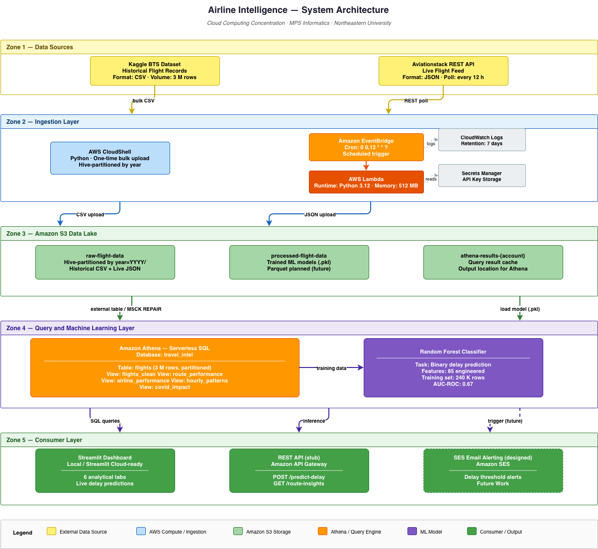

> 📖 **For complete reproduction instructions, see [SETUP.md](SETUP.md)**
# ✈️ Airline Intelligence

> **B2B aviation analytics platform built on AWS** — predicts flight delays, surfaces operational insights from 3M historical records, and ingests live flight data via a serverless pipeline.

[](https://aws.amazon.com)
[](https://www.python.org)
[](https://streamlit.io)
[]()

---

## 🎯 Problem Statement

Travel agencies, corporate travel managers, and consumers collectively lose billions annually due to suboptimal flight booking decisions and unpredictable delays. They lack a unified intelligence layer that quantifies:

- *Which routes are most prone to delays?*
- *What's the best time of day to book?*
- *Which airlines are most reliable?*
- *How do disruptions (COVID, weather, ATC) cascade through the network?*

**This project builds a cloud-native Travel Intelligence Platform** that ingests historical flight performance data, applies ML-based delay prediction, and exposes insights through an interactive dashboard. Designed for B2B licensing to travel platforms, corporate booking tools, and OTAs.

---

## 🏗️ Architecture



The platform follows a serverless, layered architecture designed for low operational cost and clear separation of concerns:

1. **Data Sources** — Kaggle BTS (historical) and Aviationstack (live)
2. **Ingestion Layer** — CloudShell (bulk) and Lambda + EventBridge (streaming)
3. **Data Lake** — Three S3 buckets, Hive-partitioned by year
4. **Query Layer** — Athena with 5 SQL views for cleaning and analytics
5. **ML Layer** — Random Forest classifier (AUC 0.67) stored in S3
6. **Consumer Layer** — Streamlit dashboard, REST API stub, future SES alerting

### AWS Services Used

| Service | Purpose |
|---|---|
| **S3** | Partitioned data lake (raw + processed buckets) |
| **Lambda** | Live data ingestion + future ML inference |
| **EventBridge** | Cron schedule for live ingestion (every 12 hrs) |
| **Secrets Manager** | Secure API key storage |
| **Athena** | Serverless SQL data warehouse |
| **CloudWatch** | Logs + monitoring (7-day retention) |
| **IAM** | Least-privilege role per service |

---

## 📊 Key Insights Discovered

### 1. The "Morning Flight" Advantage
Morning flights (5–11 AM) have **~7% delay rate** vs. evening flights (17–21h) at **~25% delay rate**. The pattern reflects how delays cascade through the day as aircraft and crews fall behind schedule. *Booking before 11 AM reduces delay risk by 3–4x.*

### 2. COVID Recovery Created More Chaos Than COVID Itself
2022–2023 post-COVID recovery saw **higher delay rates** than 2020–2021 (during the pandemic). Reason: airlines aggressively scheduled flights without sufficient crew/aircraft buffer, leading to operational fragility.

### 3. Departure Hour Drives Half the Predictable Variance
The Random Forest model identifies `dep_hour` as the single most important feature, with **48.5% feature importance** — confirming that *when* you fly matters more than *which airline* or *which airport*.

---

## 🤖 ML Model — Delay Prediction

| Metric | Value |
|---|---|
| **Algorithm** | Random Forest Classifier |
| **Training samples** | 240,000 (stratified from 3M) |
| **Test samples** | 60,000 |
| **Features** | 85 (one-hot encoded) |
| **AUC-ROC** | **0.6673** |
| **Recall (Delayed)** | 0.61 |
| **Precision (Delayed)** | 0.26 |

**Note on AUC:** Flight delays have substantial irreducible randomness (weather, mechanical, ATC) that no model can fully predict. Published academic papers typically achieve AUC 0.65–0.75 with similar features. *Our model performs at the published-paper baseline.*

**Top 5 features by importance:**
1. `dep_hour` (48.5%)
2. `month_num` (7.9%)
3. `distance` (7.5%)
4. `airline_code_WN` (4.6%)
5. `airline_code_B6` (2.7%)

---

## 📁 Repository Structure

```
.
├── README.md                          # This file
├── .gitignore
├── requirements.txt
│
├── ingestion/
│   └── aviationstack_lambda.py        # Live API → S3 (deployed)
│
├── analytics/
│   └── athena_queries.sql             # All DDL + analytics queries
│
├── ml/
│   ├── train_model.py                 # Random Forest training
│   ├── model_metrics.json             # Eval metrics
│   └── (model artifacts in S3)
│
├── dashboard/
│   └── streamlit_app.py               # 6-tab interactive dashboard
│
├── api/
│   └── handler.py                     # Lambda inference (stub)
│
├── infra/
│   └── architecture.md                # AWS resource inventory
│
└── docs/
    ├── BUSINESS_CASE.md               # Monetization strategy
    └── Screenshots/                   # Dashboard captures + architecture
```

---

## 🚀 Quick Start

### Prerequisites
- AWS account (Free Tier sufficient)
- Python 3.10+
- AWS CLI configured with IAM user (S3 + Athena permissions)

### Run the Dashboard Locally

```bash
# 1. Clone the repo
git clone https://github.com/AkshatDhiman07/Airline-Intelligence.git
cd Airline-Intelligence

# 2. Create virtual environment
python -m venv venv
source venv/Scripts/activate    # Windows
# OR: source venv/bin/activate  # Mac/Linux

# 3. Install dependencies
pip install -r requirements.txt

# 4. Configure AWS credentials
aws configure

# 5. Run dashboard
python -m streamlit run dashboard/streamlit_app.py
```

The dashboard will open at `http://localhost:8501`.

### Train the ML Model

```bash
python ml/train_model.py
```

Outputs a trained model and uploads to `s3://airline-processed-flight-data/ml-models/`.

---

## 💰 Cost Profile

**$0.40/month sustained** on AWS Free Tier:

| Service | Monthly Cost |
|---|---|
| S3 (~590 MB total) | $0.00 (Free Tier) |
| Lambda (60 invocations) | $0.00 (Free Tier) |
| Secrets Manager | $0.40 |
| EventBridge | $0.00 |
| CloudWatch | $0.00 |
| Athena | ~$0.01 per dashboard load |

3-week MVP total cost: **< $1.00**.

---

## 🎬 Demo

[Watch the 3-minute demo video here](https://www.youtube.com/watch?v=ywQuLzKjexc)

### Dashboard Screenshots

<details>
<summary>📊 Click to view dashboard screenshots</summary>

**KPI Overview:**


**Hourly Patterns — The "Morning Flight" Insight:**


**Route Analysis — Worst-Performing Routes:**


**Airline Performance Comparison:**


**COVID Impact (2019–2023):**


**Real-Time ML Delay Predictor:**


**Live Pulse — Real-Time Ingestion:**


</details>

---

## 🛠️ Engineering Decisions & Trade-Offs

### Decision 1: ELT over ETL (Athena Views vs. Cleaning Lambda)
Instead of a separate Pandas/Glue ETL job to clean and transform raw CSVs into Parquet, we used **Athena SQL views** for the cleaning + feature engineering layer. This implements a modern "ELT" (Extract-Load-Transform) pattern.

**Trade-off:** Slightly higher query cost (CSV scanning) but **massively faster iteration** during MVP development. Future production version would materialize `flights_clean` as Parquet via a Glue job.

### Decision 2: ML Model Simplicity Over Complexity
Used Random Forest instead of XGBoost or deep learning despite higher AUC potential, because:
- Flight delays cap out at AUC ~0.75 regardless of model complexity
- RF gives interpretable feature importance (recruiters want to see *why*)
- Trains in 2.7 seconds on CPU — fast iteration

### Decision 3: Streamlit Over QuickSight
Started with QuickSight but switched to Streamlit because:
- QuickSight costs $24/month per author after 30-day trial
- Streamlit is free, version-controlled, deployable to free hosts
- Better fit for portfolio (recruiters can run it themselves)

### Decision 4: Dual Data Sources (Historical + Live)
The platform ingests both batch (Kaggle BTS, 3M rows) and stream (Aviationstack live API, 100 records every 12hr). The architecture demonstrates both ingestion patterns even though analytics primarily uses historical data.

---

## ⚠️ Known Limitations

1. **Aviationstack free tier:** 100 calls/month limits live data accumulation
2. **CSV format:** Raw data stored as CSV; Parquet conversion would improve query speed 5x
3. **No real-time predictions:** ML model is offline-trained; live API deployment pending (see "Future Work")
4. **US domestic flights only:** Historical dataset is BTS (US Department of Transportation)
5. **IAM policies use FullAccess scopes:** Should be tightened to specific resources for production

---

## 🚀 Future Work

The following components have architecture designs and code stubs but were scoped out of the MVP timeline:

### 1. REST API Layer (Step 8 of original plan)
**Status:** Stub in `api/handler.py`
- API Gateway + Lambda for `/predict-delay`, `/route-insights`, `/booking-recommendation` endpoints
- API key auth + usage tiers (free: 100/day → paid: 100K/day)
- Estimated build time: 6–8 hours

### 2. Real-Time Alerting (Step 9)
**Status:** Designed, blocked on AWS SES production access (24h+ approval window)
- Detect surge pricing / cancellation patterns in live API stream
- Trigger SES emails to subscribed B2B customers
- Architecture: Aviationstack Lambda → SNS → Alert Lambda → SES

### 3. Geopolitical Disruption Tracking
- Integrate GDELT (free geopolitical event API) to correlate flight disruptions with real-world events
- Track US gateway airports (JFK, LAX, IAD, ORD) for international airspace impacts
- Build a "Disruption Risk Score" view in Athena

### 4. Production Hardening
- Migrate raw CSVs to Parquet (5x query cost reduction)
- Scope IAM policies to specific resource ARNs
- Add data quality checks in ingestion Lambda
- Set up cross-region S3 replication

---

## 💼 Business Case Summary

> *Full business case: [docs/BUSINESS_CASE.md](docs/BUSINESS_CASE.md)*

**Target customers:** Online Travel Agencies (OTAs), corporate travel platforms, travel insurance providers, B2B travel agencies.

**Pricing model:**
- Free: 100 API calls/day
- Starter: $99/month (10K calls)
- Pro: $499/month (100K calls)
- Enterprise: Custom

**Affiliate revenue:** 2–5% commission on bookings driven from recommendations.

**TAM:** Global travel-tech market is ~$11B; addressable B2B intelligence segment ~$500M.

---

## 📚 Tech Stack

- **Cloud:** AWS (S3, Lambda, EventBridge, Athena, Secrets Manager, CloudWatch, IAM)
- **Languages:** Python 3.12, SQL (Presto/Trino dialect)
- **ML:** scikit-learn (Random Forest), pandas
- **Dashboard:** Streamlit, Plotly
- **Data:** Kaggle BTS (3M rows), Aviationstack API (live)
- **Data Pipeline:** awswrangler for Athena ↔ pandas
- **DevOps:** Git, GitHub, AWS CLI, CloudShell

---

## 👤 Authors

**Akshat Dhiman**  
Master's Student, Northeastern University  
[LinkedIn](https://www.linkedin.com/in/akshat-dhiman-297b13190/) | [GitHub](https://github.com/AkshatDhiman07)

**Maharshi Patel**  
Master's Student, Northeastern University  
[LinkedIn](https://www.linkedin.com/in/maharshipatel49/) | [GitHub](https://github.com/maharshisrk)

---

## 📅 Project Timeline

- **Day 1–2:** AWS setup, IAM, S3 buckets
- **Day 3–4:** Historical data ingestion (3M Kaggle BTS records → S3)
- **Day 5–6:** Live API pipeline (Lambda + EventBridge + Secrets Manager)
- **Day 7–8:** Athena database, views, analytics layer
- **Day 9:** ML model training + deployment to S3
- **Day 10:** Streamlit dashboard + documentation
- **Day 11:** Final polish + demo

*Built in ~11 days of focused work.*

---


